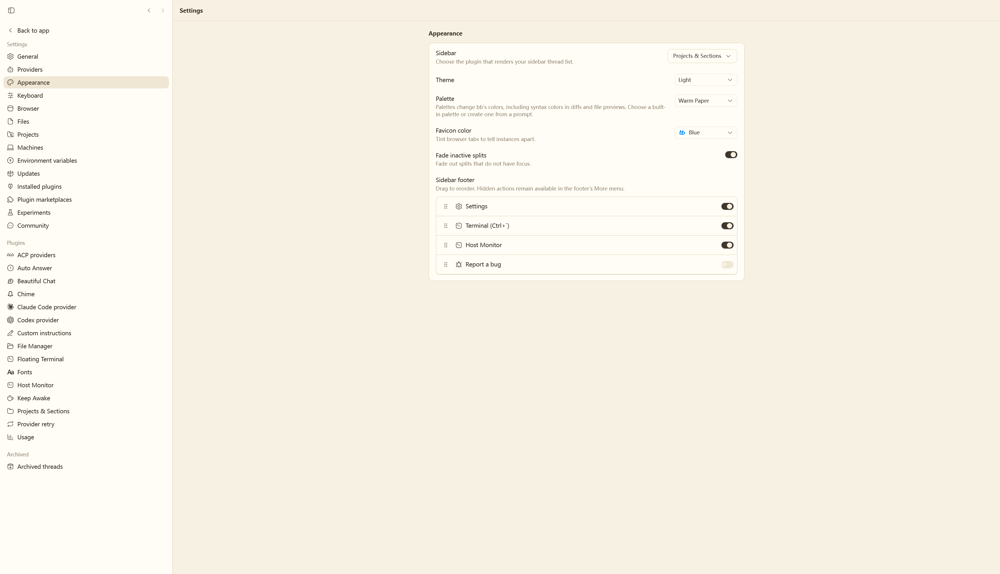

# Warm Paper for bb

A BB theme plugin that brings the **暖纸 / Warm Paper** palette from [pi-web-ui](https://github.com/xing-shuyin/pi-web-ui/blob/main/themes/paper.css) to BB.

The theme is declarative: BB loads `themes/warm-paper.css` from the theme entry in `package.json`. It uses the original palette's canvas (`#f7f1e3`), raised surface (`#fffdf6`), parchment secondary (`#efe7d3`), ink (`#3f372c`), borders, amber accent, semantic colors, and terminal colors, mapped to BB's theme tokens. The package layout follows [bb-plugin-chatgpt-skin](https://github.com/euanguo/bb-plugin-chatgpt-skin).

## Preview



## Install

```sh
bb plugin build .
bb plugin install "path:$PWD" --yes
```

Then select **Warm Paper** in BB's theme picker. After editing the stylesheet, rebuild and reload the plugin:

```sh
bb plugin build .
bb plugin reload warm-paper-skin
```

## Files

- `themes/warm-paper.css` — Warm Paper palette mapped to BB theme tokens.
- `package.json` — BB plugin and theme manifest.
- `server.ts` — minimal required plugin entry; no runtime behavior.
